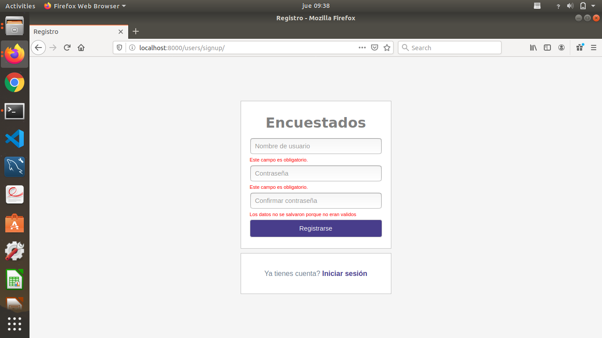
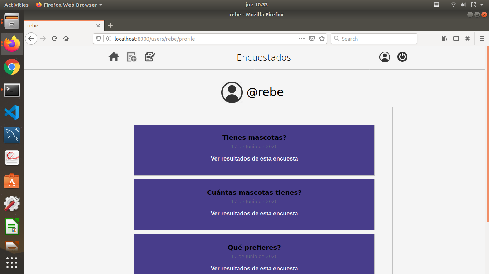
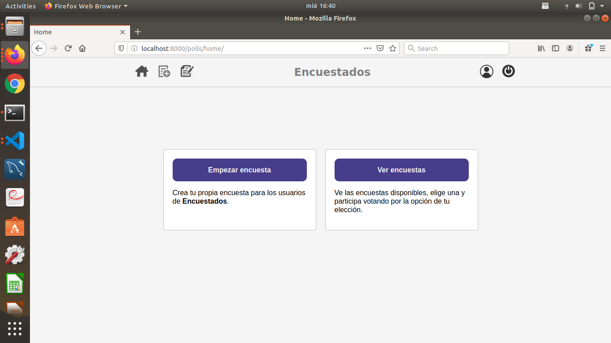
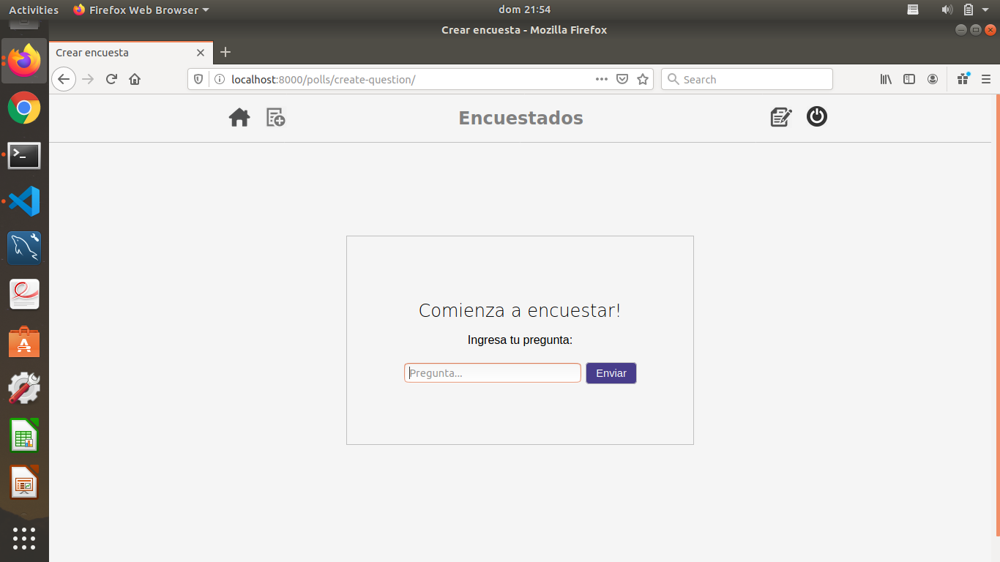
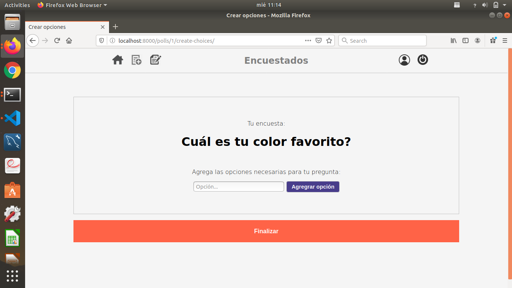
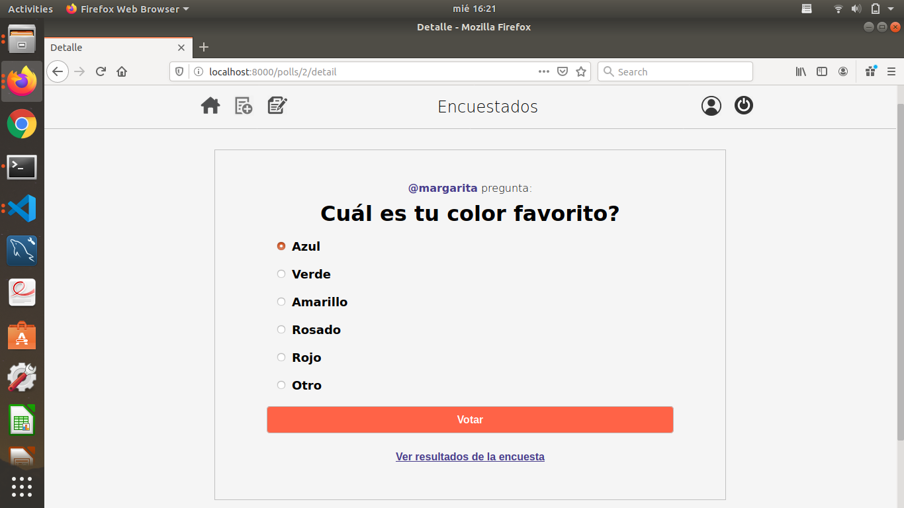
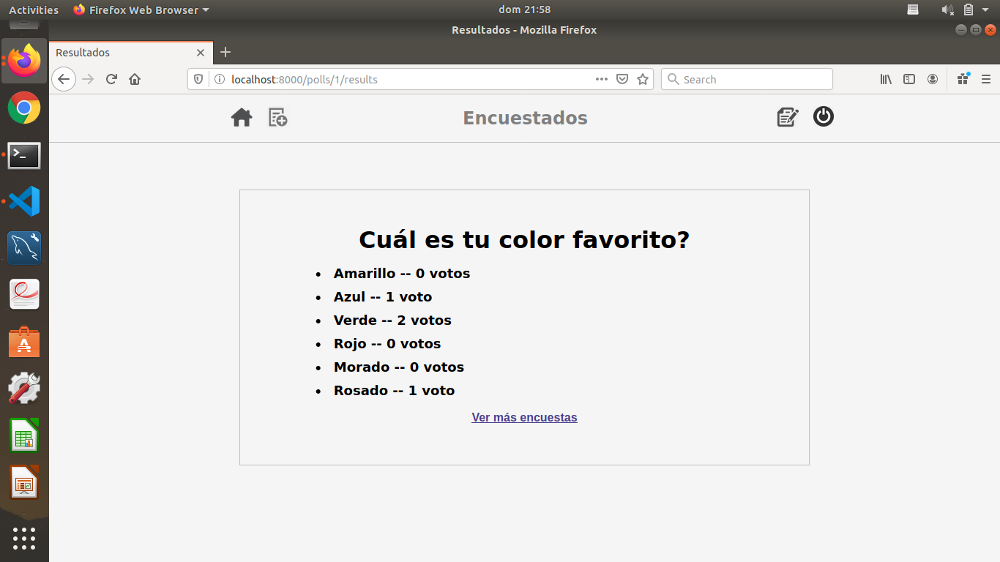
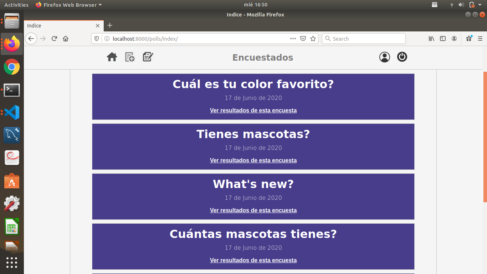

# MY POLLS SITE

**Encuestados** is public site for share and solve polls based on the "Writing your first Django app" tutorial
in the Django documentation but improve it adding a complete users interface and a more complex and safe functionality
using the Django authentication system. I developed this project in Django 3.0.7 and works with two apps: **users and polls**.

# Users

The users app let people **signup**, **login** and has a **basic profile**. User model provides a control in votes and 
polls publication.

**Login**

**Signup**

**User profile**

# Polls

The polls app let users create and view polls also vote them, displaying poll results and see a detail about 
the poll and the user who created it.

**Home**

**Create a question**

**Add choices**

**Poll**

**Poll results**

**Polls index**

